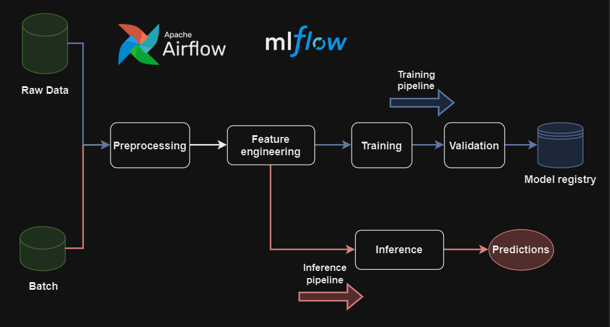

<a name="readme-top"></a>

[![Forks][forks-shield]][forks-url]
[![Stargazers][stars-shield]][stars-url]
[![LinkedIn][linkedin-shield]][linkedin-url]


# Reservation Cancellation Forecasting: a Senior Machine Learning Engineer assignment



In this repository, you'll find a project I handled during a Machine Learning assignment for a leader in the short-term rental industry. 

The objective of this assignment was clear: 
* Build a Machine Learning model to predict whether a reservation is likely to be cancelled,
* Develop an MLOps architecture designed for a production environment.

To accomplish this task, **Airflow** and **Mlflow** are used to build Machine Learning Pipelines, fully customizable and ready for a production environment.

This Github repo comes with a complete article published in the [Towards Data Science](https://towardsdatascience.com/) journal on Medium:

## Article link

[Build Machine Learning Pipelines with Airflow and Mlflow: Reservation Cancellation Forecasting.](https://medium.com/towards-data-science/build-machine-learning-pipelines-with-airflow-and-mlflow-reservation-cancellation-forecasting-da675d409842)

## Code organization

```sh
.
├── README.md
├── airflow
│   ├── dags
│   │   ├── inference_pipeline.py
│   │   └── training_pipeline.py
├── artifacts
├── data
│   ├── features_store
│   ├── preprocessed
│   ├── hotel_bookings.parquet
│   └── sample_for_inference.parquet
├── mlflow
├── notebooks
│   ├── 0_exploratory_data_analysis.ipynb
│   └── 1_preprocessed_data_check.ipynb
├── requirements.txt
└── steps
    ├── condition_step.py
    ├── config.py
    ├── feature_engineering_step.py
    ├── inference_step.py
    ├── preprocess_step.py
    ├── train_step.py
    └── utils
        ├── _artifact.py
        └── data_classes.py
```

The repository is structured as follows:

* **Data Exploratory Analysis (EDA)** is performed on **notebooks**,
* Each stage of the Machine Learning process (**Preprocessing**, **Training**, **Inference**, etc...) is defined as a module designed to be implemented into a pipeline. They are all located in the *steps/* folder.
* **Airflow** and **Mlflow** are deployed locally within this repository.
* In the *data* folder is located the original dataset that was provided for this assignement, in addition of a sample for batch prediction. *data/features_store* and *data/preprocessed* are directories to store the data once processed by some stages of the pipelines, such as **preprocessing** or **features_engineering** steps.
* The same idea for *artifacts* that contains **encoders** generated during the **features_engineering** step.


<p align="right">(<a href="#readme-top">back to top</a>)</p>


## Getting started

The code runs with Airflow and Mlflow. 

To launch these applications, open a terminal for each and type their respective command lines after having installed them. The complete procedure can be found in the [article](https://medium.com/towards-data-science/build-machine-learning-pipelines-with-airflow-and-mlflow-reservation-cancellation-forecasting-da675d409842).

```sh
# Terminal 1
mlflow server --backend-store-uri mlflow/ --artifacts-destination mlflow/ --port 8000
```

```sh
# Terminal 2
airflow standalone
```

<p align="right">(<a href="#readme-top">back to top</a>)</p>

## Contributing

Contributions are what make the open source community such an amazing place to learn, inspire, and create. Any contributions you make are **greatly appreciated**.

If you have a suggestion that would make this better, please fork the repo and create a pull request. You can also simply open an issue with the tag "enhancement".
Don't forget to give the project a star! Thanks again!

1. Fork the Project
2. Create your Feature Branch (`git checkout -b feature/AmazingFeature`)
3. Commit your Changes (`git commit -m 'Add some AmazingFeature'`)
4. Push to the Branch (`git push origin feature/AmazingFeature`)
5. Open a Pull Request

<p align="right">(<a href="#readme-top">back to top</a>)</p>


<!-- MARKDOWN LINKS & IMAGES -->
[linkedin-url]: https://www.linkedin.com/in/jeremy-arancio/
[linkedin-shield]: https://img.shields.io/badge/-LinkedIn-black.svg?style=for-the-badge&logo=linkedin&colorB=555
[stars-shield]: https://img.shields.io/github/stars/jeremyarancio/reservation_cancellation_prediction.svg?style=for-the-badge
[stars-url]: https://github.com/jeremyarancio/reservation_cancellation_prediction/stargazers
[forks-shield]: https://img.shields.io/github/forks/jeremyarancio/reservation_cancellation_prediction.svg?style=for-the-badge
[forks-url]: https://github.com/jeremyarancio/reservation_cancellation_prediction/network/members